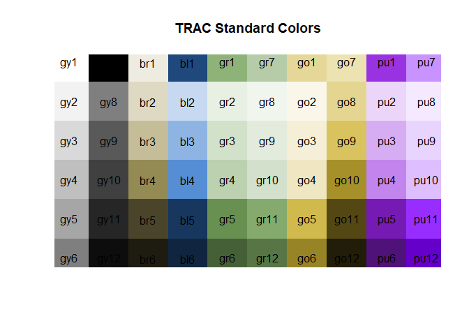
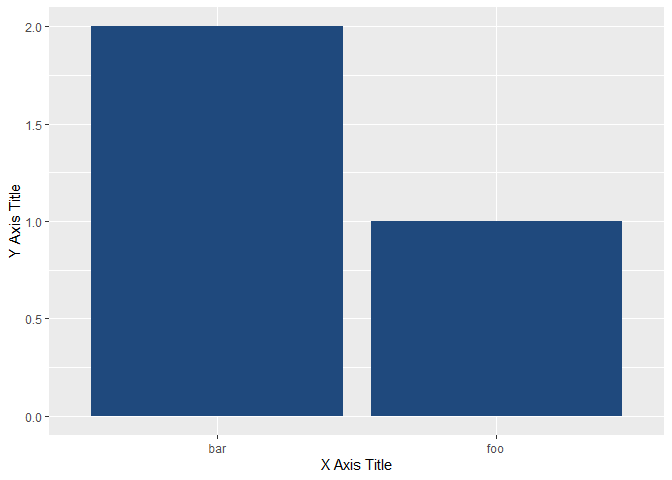

<!-- README.md is generated from README.Rmd. Please edit the .Rmd file and generate the .md file with devtools::build_readme(). -->

# TRACcolors

A simple R package to display TRAC standard colors and generate those
colors in hex format for use in plotting.

## Installation

The **TRACcolors** package is not available on CRAN but can be installed
with the **remotes** package. For example,
`remotes::install_github("jfking50/TRACcolors")`.

## Quick Demo

Display a grid of TRAC colors and their associated color code with
`colorgrid()`.

``` r
library(TRACcolors)
colorgrid()
```



Referring to this plot, choose the color(s) of interest in the plotting
package of your choice. Note in the example below that `tcolor("bl1")`
is a string that is the associated color in hex format.

``` r
library(ggplot2)
ggplot() + 
  geom_col(aes(x=c("foo", "bar"), y=1:2), fill = tcolor("bl1")) +
  xlab("X Axis Title") + ylab("Y Axis Title")
```


